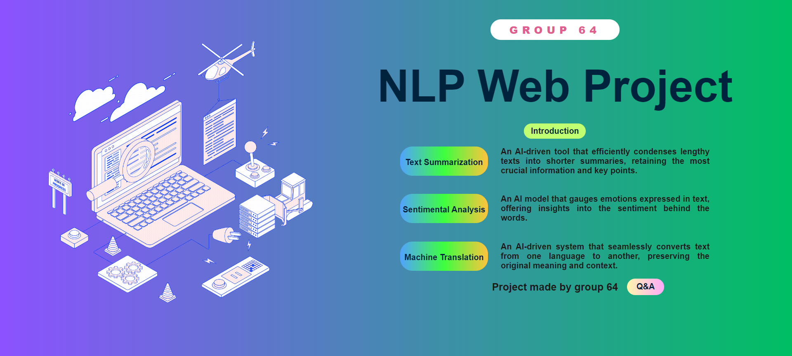

# NLP Web Project
<div align="left">
	<a href="https://github.com/VinhLL/titles-generator/graphs/contributors">
		
	</a>
	<a href="">
		
	</a>
	<a href="https://github.com/VinhLL/titles-generator/network/members">
		
	</a>
	<a href="https://github.com/VinhLL/titles-generator/stargazers">
		
	</a>
	<a href="https://github.com/VinhLL/titles-generator/issues/">
		
	</a>
	</p>
	
<h4>
	<a href="#">View Demo</a>
<span> · </span>
	<a href="https://github.comVinhLL/titles-generator/issues/">Report Bug</a>
<span> · </span>
	<a href="https://github.comVinhLL/titles-generator/issues/">Request Feature</a>
</h4>
</div>
</h4>


## About the Project
<p>
		The NLP Web Project is the capstone project for our Software Engineering course, aimed at exploring the dynamic field of Natural Language Processing (NLP). This project intersects artificial intelligence, linguistics, and computer science, focusing on practical applications of NLP to solve real-world problems.

</p>

## Technology employed in the project
+ **Frontend:**
	- HTML
	- CSS
	- JavaScript
+ **Backend:**
	- Django
+ **Database**
	- Database management system: SQLAlchemy
+ **Version Control and Source Code Management**
	- Version Control : Github
	- Source Code Management : Git Flow, Feature Branching
+ **Security and Authentication**
	- JSON Web Tokens, OAuth
+ **Key Functionalities:**
	<p> 
		The NLP Web Project showcases several functionalities that highlight the capabilities of NLP technologies:
	</p>

	- Text Summarization: Condenses long documents into concise summaries.

	- Sentiment Analysis: Identifies and extracts subjective information from text, determining the sentiment expressed.

	- Machine Translation: Automatically translates text from one language to another.

	<p>
		These features demonstrate the practical benefits of NLP technologies in processing and interacting with textual data, illustrating their applications in understanding and manipulating human language.
	</p>

## Installation and Usage
1. **Activate the virtual environment:**
```
	.venv\Scripts\Activate.ps1
```
2. **Install the required packages:**
```
	python -m pip install -r requirements.txt
```
3. **Run the server:**
```
	python manage.py runserver
```

## Persona
### Name: Bui Q V

- **Age:** 15
- **Occupation:** Student
- **Goal:**
  - Understand and summarize long articles and study materials quickly.
  - Identify and comprehend the sentiment in various texts to aid in studies and personal growth.
  - Translate foreign language texts for better understanding and learning.

### Challenges:
- Difficulty in summarizing lengthy study materials and articles efficiently.
- Struggling to grasp the underlying sentiment in texts, which impacts comprehension and communication skills.
- Language barriers when dealing with texts in foreign languages.

### Solutions Needed:
- A tool that can quickly and accurately summarize long documents, making studying more efficient.
- An application that can analyze and identify sentiment in texts to improve comprehension and emotional intelligence.
- A reliable machine translation feature to assist in understanding and learning from foreign language texts.

### Using NLP Web Project:
Bui Q V uses the NLP Web Project to:
- **Text Summarization:** Condense lengthy study materials into concise summaries for easier studying and revision.
- **Sentiment Analysis:** Analyze texts to understand the sentiment and improve comprehension and communication.
- **Machine Translation:** Translate foreign language texts into their native language to enhance learning and understanding.

### Benefits:
- Helps Bui Q V study more efficiently by summarizing lengthy documents.
- Enhances comprehension and communication skills through sentiment analysis.
- Overcomes language barriers, enabling learning from diverse sources.

### Conclusion:
Bui Q V is a typical user of the NLP Web Project, utilizing text summarization, sentiment analysis, and machine translation features. These functionalities help Bui Q V manage study materials effectively, understand sentiments in texts, and overcome language barriers, thereby improving overall learning and comprehension.

## Timeline
+ **Backend** : 15/4/2024
+ **Frontend** :30/4/2024
+ **Initalize Models**: 3/5/2024
+ **Project Timeline Summary** : 20/2/2024 - 15/5/2024

+ ## Demo Video

Watch the demo video [here](https://drive.google.com/file/d/1yrKUuPHWSoV96Nd-0NaWOTd2WRGP1lDH/view?pli=1).

## Visit our website:
Click [here]() to go to the Something something website

## Contributors

Thanks to the following people who have contributed to this project:

- [@22022671-Sang-Tran](https://github.com/22022671-Sang-Tran)
- [@HvTung04](https://github.com/HvTung04)
- [@QuanVuong14](https://github.com/QuanVuong14)
- [@VinhLL](https://github.com/VinhLL)
